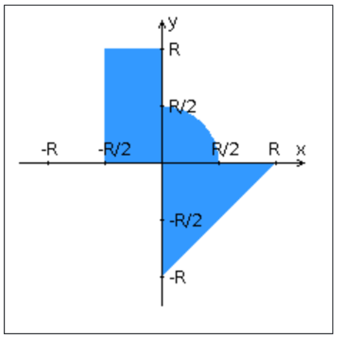

# WEB LAB 4

## Общие требования
Переписать приложение из предыдущей лабораторной работы (https://github.com/arthkinq/web-lab3) с использованием следующих технологий:

### Уровень back-end
- Основан на **Java EE**
- Необходимо использовать **EJB**

### Уровень front-end
- Построен на **React + Redux**
- Использовать **ES6 и JSX**
- Использовать набор компонентов **React Toolbox**

### Взаимодействие между уровнями
- Организовано посредством **REST API**

## Требования к адаптивности
Приложение должно поддерживать 3 режима отображения:

1. **Десктопный** - ширина экрана ≥ 1225px
2. **Планшетный** - ширина экрана ≥ 827px и < 1225px
3. **Мобильный** - ширина экрана < 827px

## Структура страниц

### Стартовая страница
**Элементы:**
- "Шапка", содержащая:
    - ФИО студента
    - Номер группы
    - Номер варианта
- Форма для ввода логина и пароля

**Требования к безопасности:**
- Информация о пользователях хранится в отдельной таблице БД
- Пароль хранится в виде хэш-суммы
- Доступ неавторизованных пользователей к основной странице запрещён

### Основная страница приложения
**Элементы:**

1. **Поля ввода для проверки точки:**
    - Координата X: Кнопки `[-4, -3, -2, -1, 0, 1, 2, 3, 4]`
    - Координата Y: Input с диапазоном от -5 до 5
    - Радиус области: Кнопки `[-4, -3, -2, -1, 0, 1, 2, 3, 4]`
    - *Требуется валидация вводимых данных*

2. **Интерактивная картинка:**
    - Динамически обновляемое изображение области на координатной плоскости
    - Отображение точек, координаты которых заданы пользователем
    - Цвет точек зависит от факта попадания/непопадания в область
    - Функциональность:
        - Клик по картинке определяет координаты новой точки и отправляет на сервер
        - Смена радиуса инициирует перерисовку картинки

3. **Таблица результатов:**
    - Список результатов предыдущих проверок

4. **Элементы управления:**
    - Кнопка для закрытия сессии и возврата на стартовую страницу

## Требования к работе с данными
- Для доступа к БД необходимо использовать **JPA**
 